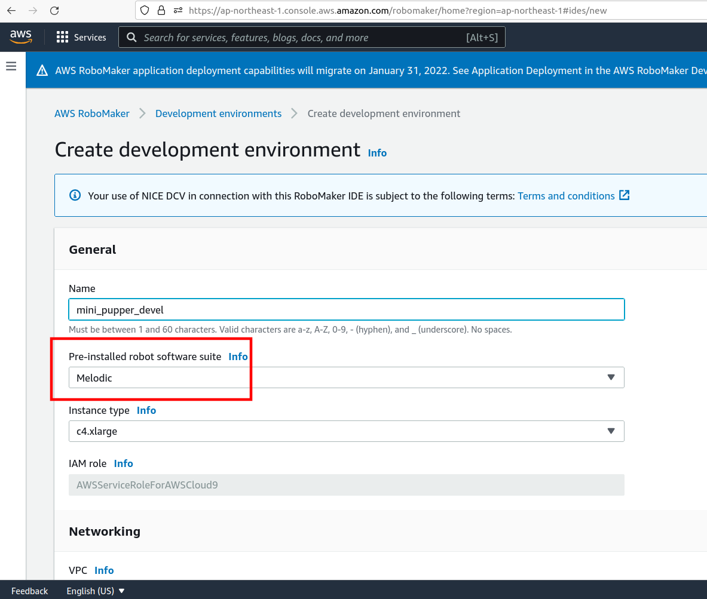
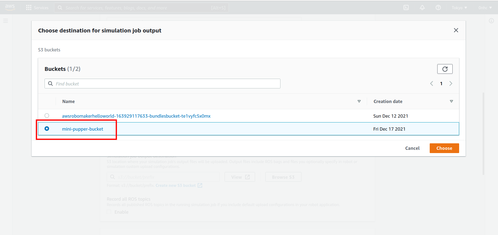
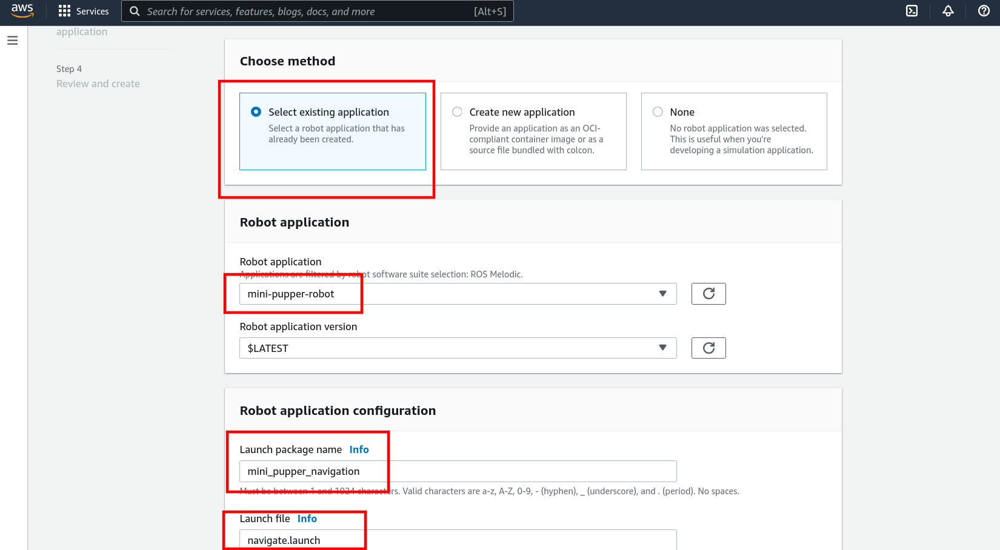

# Instructions for Creating an AWS RoboMaker Environment for Mini Pupper

## 1.Create a AWS RoboMaker Intergrated Development Environment
create a development environment in aws robomaker console,</br>
[check this link](https://ap-northeast-1.console.aws.amazon.com/robomaker/home?region=ap-northeast-1#ides/new)</br>
remember to set "pre-installed robot software suite" to "Melodic"</br>

</br>

## 2. Configure Your Development Environment
### 2.1 Install Colcon


```sh
sudo apt-get update
sudo apt-get install python3-pip python3-apt
```
```sh
pip3 install -U setuptools
pip3 install -U colcon-common-extensions colcon-ros-bundle
```
### 2.2 Dependencies
```sh
sudo apt install ros-melodic-ecl-threads ros-melodic-robot-localization  ros-melodic-controller-manager ros-melodic-hector-sensors-description ros-melodic-map-server ros-melodic-move-base ros-melodic-iris-lama ros-melodic-iris-lama-ros sphinxsearch
```
```sh
pip install --upgrade requests
pip3 install --upgrade requests
```

### 2.3 Configure the Application
```sh
cd ~/environment
git clone --recursive https://github.com/0nhc/aws-robomaker-mini-pupper-application.git
cd aws-robomaker-mini-pupper-application
git submodule init
git submodule update
cd robot_ws
colcon build
colcon bundle
cd ..
cd simulation_ws
colcon build
colcon bundle
echo "source ~/environment/aws-robomaker-mini-pupper-application/robot_ws/install/setup.bash" >> ~/.bashrc
echo "source ~/environment/aws-robomaker-mini-pupper-application/simulation_ws/install/setup.bash" >> ~/.bashrc
source ~/.bashrc
```

### 2.4 Create an AWS S3 Bucket
create S3 buckets for mini pupper</br>
[check this link](https://s3.console.aws.amazon.com/s3/bucket/create?region=ap-northeast-1)</br>
set "bucket name" to "mini-pupper-bucket"</br>


### 2.5 Upload Bundle Files to The Bucket
return to aws development environment</br>

```sh
cd ~/environment/aws-robomaker-mini-pupper-application/robot_ws/bundle
aws s3api put-object --bucket mini-pupper-bucket --key mnpp_robot.tar --body output.tar
cd ~/environment/aws-robomaker-mini-pupper-application/simulation_ws/bundle
aws s3api put-object --bucket mini-pupper-bucket --key mnpp_sim.tar --body output.tar
```

## 3. Create a Robot Application
return to robomaker console</br>
then create a new robot application</br>
[check this link](https://ap-northeast-1.console.aws.amazon.com/robomaker/home?region=ap-northeast-1#robotApplications/new)</br>
set "name" to "mini-pupper-robot"</br>
set "robot software suite" to "Melodic"</br>
set "application" to "provide a colcon-bundled source file"</br>
and then click "browse S3"</br>

choose "mini-pupper-bucket/mnpp_robot.tar"</br>
then click "create"</br>


## 4. Create a Simulation Application
return to robomaker console</br>
then create a new simulation application</br>
[check this link](https://ap-northeast-1.console.aws.amazon.com/robomaker/home?region=ap-northeast-1#robotApplications/new)</br>
set "name" to "mini-pupper-simulation"</br>
set "robot software suite" to "Melodic"</br>
set "application" to "provide a colcon-bundled source file"</br>
and then click "browse S3"</br>

choose "mini-pupper-bucket/mnpp_sim.tar"</br>
then click "create"</br>


## 5. Create a Simulation Job
return to robomaker console</br>
then create a new simulation job</br>
[check this link](https://ap-northeast-1.console.aws.amazon.com/robomaker/home?region=ap-northeast-1#simulationJobs/new)</br>

### 5.1
in section "simulation job details"</br>
set "simulation job duration" to 1 hour(for saving money)</br>
set "robot software suite" to "Melodic"</br>
set "IAM role" to whatever you want</br>

in section "simulation job output"</br>
click "browse S3"</br>

choose "mini-pupper-bucket"</br>


### 5.2
in section "choose method"</br>
click "select existing application"</br>

in section "robot application"</br>
choose "mini-pupper-robot"</br>

in section "robot application configuration"</br>
set "launch package name" to "mini_pupper_navigation"</br>
set "launch file" to "navigate.launch"</br>


### 5.3
in section "choose method"</br>
click "select existing application"</br>

in section "robot application"</br>
choose "mini-pupper-simulation"</br>

in section "robot application configuration"</br>
set "launch package name" to "mini_pupper_gazebo"</br>
set "launch file" to "gazebo.launch"</br>


### 5.4
just click "create"</br>


## 6 Just Play With It


